

  

# 🍽️ PedeAI   
O **PedeAI** é um sistema de gerenciamento de pedidos em restaurantes, desenvolvido para **digitalizar o fluxo do garçom à cozinha**, agilizando o atendimento e permitindo o pagamento das mesas.  
**Problema que resolve:** atualmente, pedidos são anotados manualmente, o que gera **erros de escrita, atrasos na cozinha e comunicação ineficiente** entre equipe de atendimento e cozinha. O PedeAI reduz esses problemas, tornando o serviço mais rápido, preciso e organizado.

---

## Universidade  
Universidade Federal do Tocantins  

## Curso  
Ciência da Computação  

## Disciplina  
Engenharia de Software  

## Semestre  
2º semestre de 2025  

## Professor  
Edeílson Milhomem  

## Integrantes do Projeto  
- Arthur Vinicíus de Oliveira Carvalho
- Ester Arraiz de Matos  
- Jorge Antônio Motta Braga  
- Matheus Henrique de Freitas
- Vitória Maria Reis Fontana

---
## 🌐 Acesso ao Sistema e Demonstração

🔗 **Acessar versão pública do sistema:**  
https://pedeai-r6z7.onrender.com/

🎥 **Vídeo demonstrativo (YouTube):**  
https://www.youtube.com/watch?v=lmjdiEXJb3M

---

## 🔧 Guia de Instalação e Configuração
Para clonar, configurar e executar o PedeAI em ambiente local, consulte o guia completo:

[Acessar documentação de setup](docs/setup.md)

---

## 🎯 Escopo do Projeto  
O sistema de gerenciamento de pedidos PedeAI tem como objetivo digitalizar e otimizar o processo de atendimento em restaurantes, garantindo mais agilidade e eficiência na comunicação entre a equipe.

O cliente **não interage diretamente com o sistema**, sendo atendido normalmente pelo garçom.  

O sistema é acessado apenas por perfis de usuários internos:  

- **Garçom**: anota os pedidos em um dispositivo móvel (tablet/smartphone) e os envia diretamente para a cozinha.  
- **Cozinha**: recebe os pedidos em tempo real em uma tela e atualiza o status de preparo.  
- **Caixa**: visualiza os pedidos finalizados por mesa para realizar o fechamento da conta.  
- **Administrador**: gerencia o cardápio, os usuários do sistema e acessa relatórios de vendas.  

---

## 🚀 Produto Mínimo Viável (MVP)

**Foco:** Entregar um sistema funcional que digitalize todo o fluxo de pedidos do garçom até a cozinha, com pagamento básico, e permita administração mínima do restaurante.

### Funcionalidades (MVP final após todas as iterações)
- **Autenticação geral com redirecionamento por perfil** (US01, US04, US06, US08)  
- **Gerenciamento de Cardápio pelo Administrador** (US08)  
- **Cadastro e lançamento de pedidos pelo Garçom** (US02)  
- **Recebimento de pedidos pela Cozinha** (US04)  
- **Visualização de pedidos e pagamento pelo Caixa** (US06, US07)  
- **Cadastro de novos funcionários pelo Administrador** (US09)  
- **Geração de Relatórios de Vendas pelo Administrador** (US10)  

### Fora do escopo do MVP
- **Funcionalidades administrativas complexas**  
- **Status detalhado dos pedidos** (US03, US05)
- **Geração de PDF do cardápio com link público para o cliente**

---
## 📖 User Stories  

### Garçom  
- **US01**: Como garçom, quero ver as mesas ocupadas para registrar e gerenciar os pedidos dos clientes.  
- **US02**: Como garçom, quero cadastrar o pedido do cliente de forma digital para que seja enviado instantaneamente à cozinha.  
- **US03**: Como garçom, quero visualizar o status do pedido (em preparo, pronto) para poder informar o cliente.  

### Cozinha  
- **US04**: Como cozinheiro, quero receber os pedidos em tempo real em uma tela para iniciar o preparo sem demora.  
- **US05**: Como cozinheiro, quero atualizar o status do pedido para que o garçom e o caixa saibam quando está pronto para ser entregue ou cobrado.  

### Caixa  
- **US06**: Como caixa, quero visualizar todos os pedidos finalizados de uma mesa para gerar a conta do cliente com precisão.  
- **US07**: Como caixa, quero registrar o pagamento (parcial ou total) para concluir o atendimento e fechar a conta.  

### Administrador  
- **US08**: Como administrador, quero gerenciar o cardápio (adicionar, editar, remover itens e preços) para manter as opções sempre atualizadas.  
- **US09**: Como administrador, quero gerenciar os usuários (criar, editar e desativar perfis) para controlar os acessos ao sistema.  
- **US10**: Como administrador, quero gerar relatórios de vendas para acompanhar o desempenho financeiro do restaurante.  

---

## 📌 Planejamento das Iterações
Este arquivo detalha todas as iterações planejadas do projeto, descrevendo o valor agregado ao cliente e as funcionalidades previstas.  
[Abrir planejamento das iterações](docs/planejamento.md)

---

## 📄 Apresentação Final
Acesse aqui a apresentação oficial entregue ao professor:

👉 [PedeAI — Apresentação Final](docs/PedeAI-Apresentacao-Final.pdf)

---

## 💻 Histórico de Implementações
Este arquivo contém todas as features implementadas em cada iteração, junto com os responsáveis e revisores (PR).  
[Abrir registro de features](docs/features.md)

---

## 📱Protótipo

### Garçom  (US01, US02, US03)

  
  

  

### Cozinha (US04, US05)

  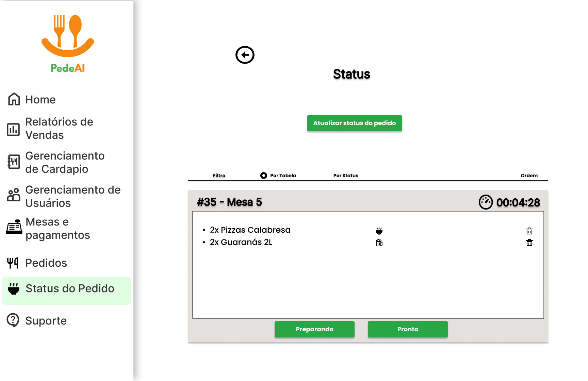
  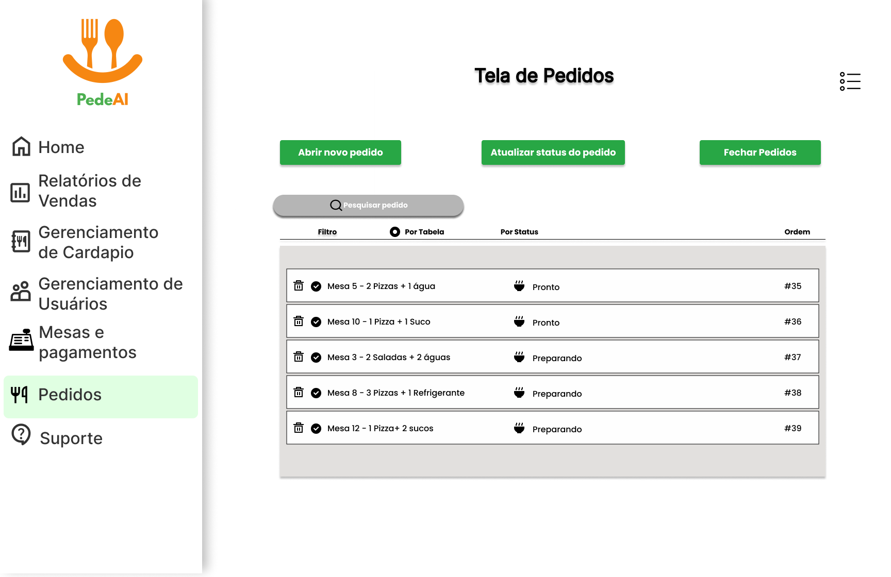

### Caixa (US06, US07)

  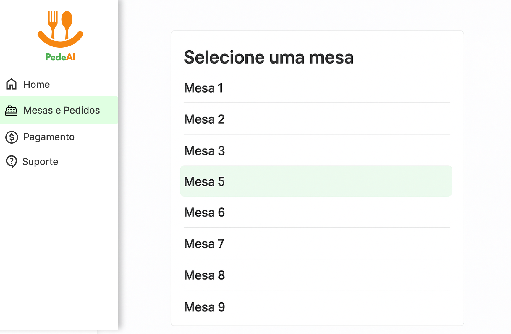
  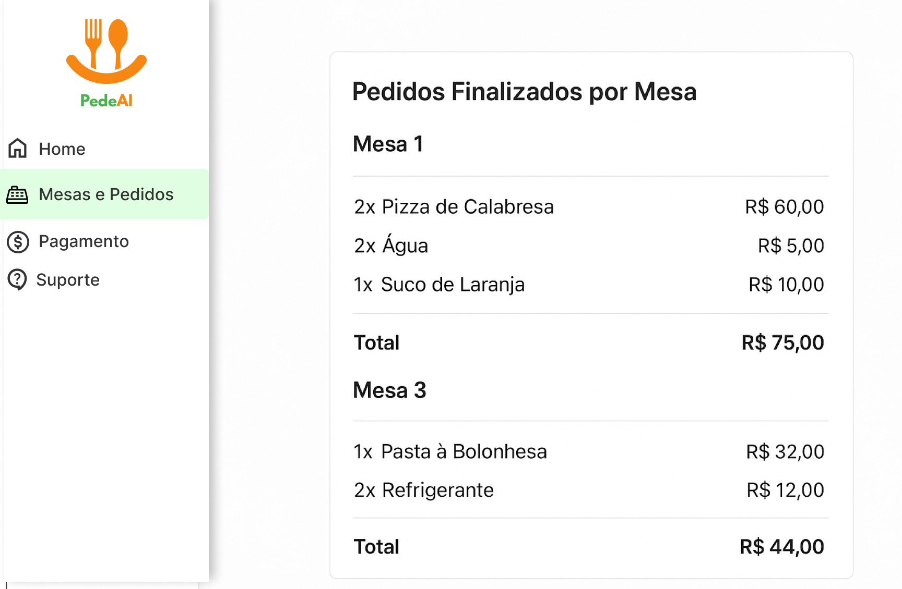

  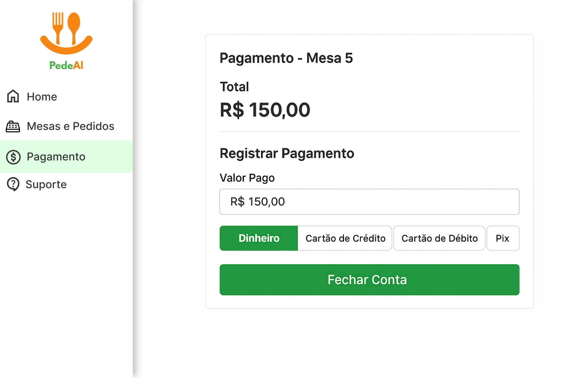

### Administrador  (US08, US09, US10)

  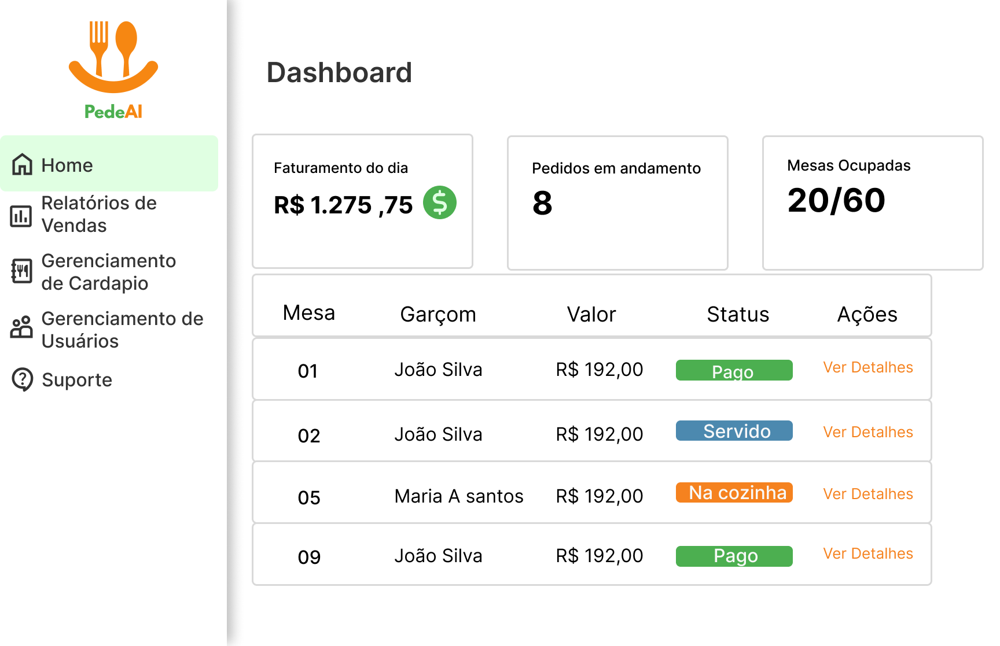
  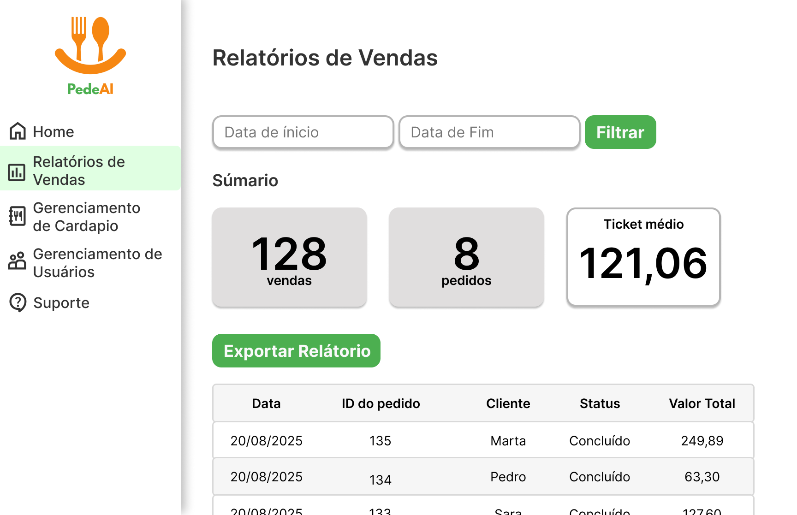

  
  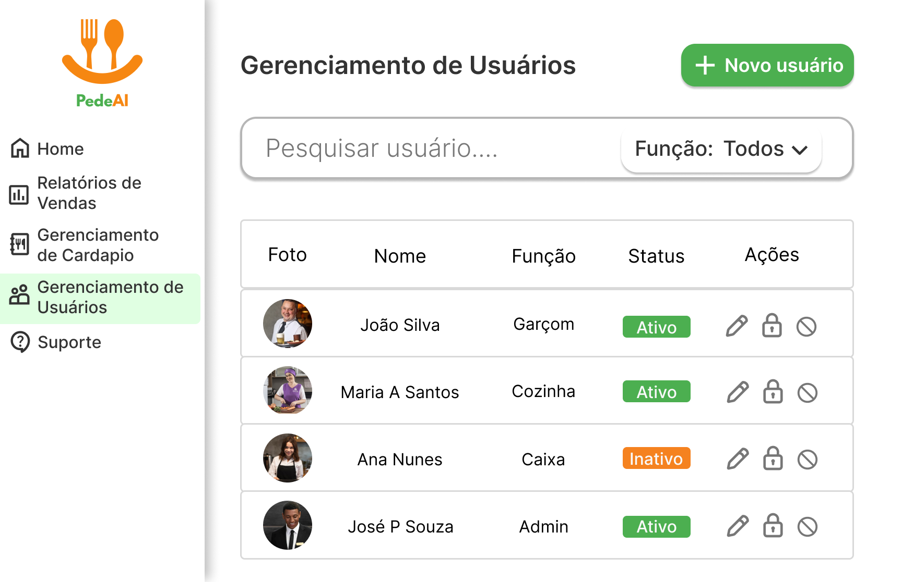

  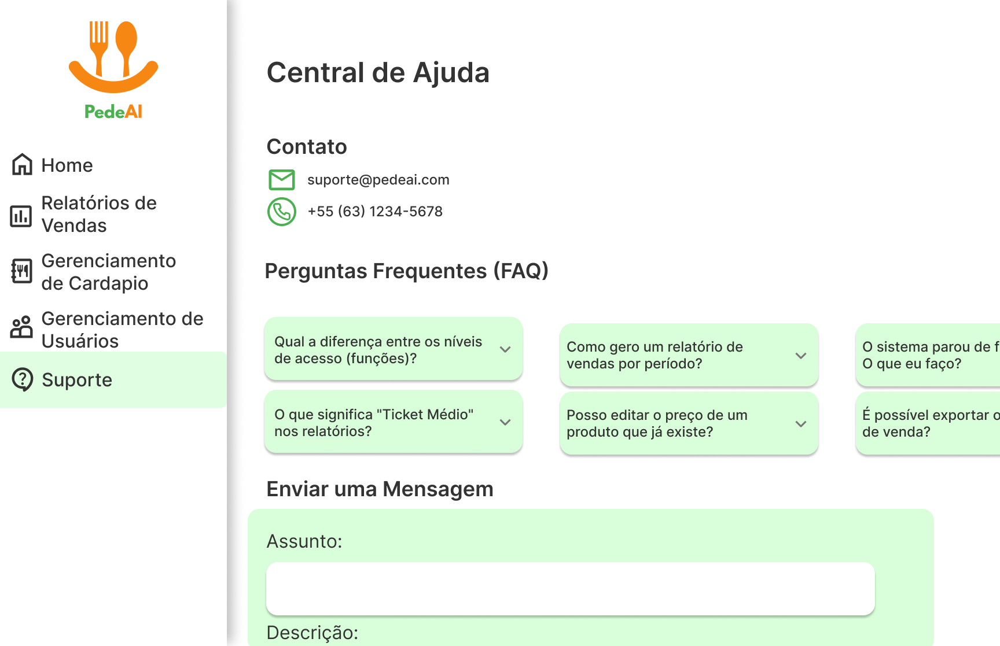

### Cadastro e Login

  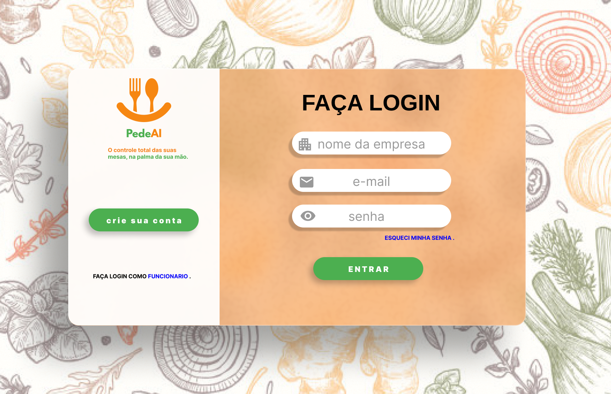
  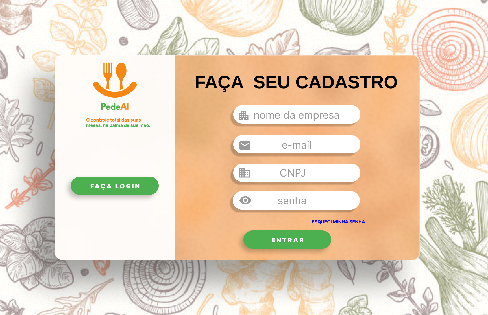

  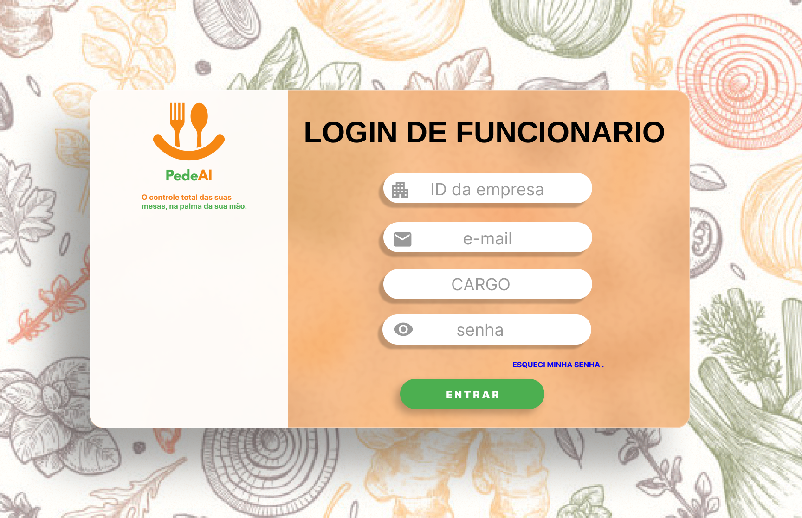

